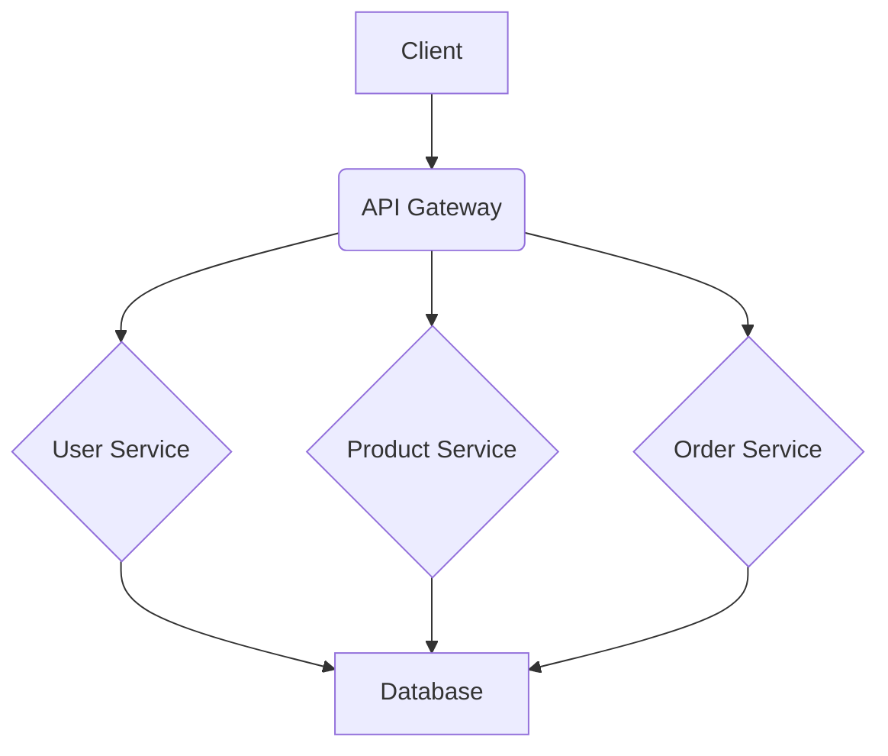
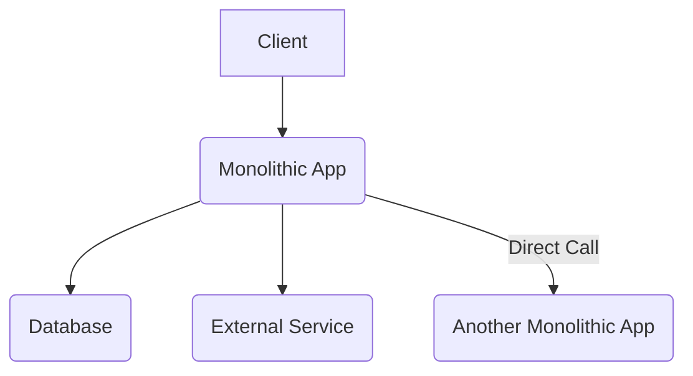

# Rule: Backend Service Architecture

**Description:** This rule provides guidelines for making informed decisions about backend service architectures, including the choice between microservice and monolithic patterns. It also covers best practices for inter-service communication, implementing fault tolerance, and defining clear architectural outputs to ensure robust and scalable systems.

**Rationale:** The choice of architecture significantly impacts scalability, development speed, operational complexity, and system resilience. Robust inter-service communication and effective fault tolerance mechanisms are critical for maintaining stability and performance in distributed systems. Clearly defined architectural outputs ensure documentation and alignment with project goals.

### Core Principles:
- **Architecture Choice:** Make an informed choice between microservice and monolithic architectures based on project requirements, team size, and scalability needs.
- **Inter-Service Communication:** Choose appropriate protocols for inter-service communication (e.g., HTTP/REST, gRPC, message queues) considering latency, throughput, and reliability.
- **Service Discovery & Load Balancing:** Implement robust service discovery and load balancing mechanisms to ensure services can find each other and distribute traffic efficiently.
- **Fault Tolerance:** Utilize patterns like circuit breakers, retries, and bulkheads for fault tolerance and resilience in distributed systems.
- **Distributed Tracing:** Implement unique request IDs for distributed tracing to enable end-to-end visibility and easier debugging (referencing `distributed-tracing.md`).

### Good Practice:

*Example: A microservices architecture with an API Gateway, demonstrating clear service boundaries.*

### Bad Practice:

*Example: A monolithic application with tight coupling and direct calls to other large applications, leading to scalability and maintenance issues.*

---

**Automation Potential:** Container orchestration platforms (e.g., Kubernetes) automate service discovery and load balancing. Infrastructure as Code (IaC) tools can automate the deployment of architectural components. Code reviews are essential for validating architectural decisions and adherence to principles.

**Further Reading:** [Optional: Links to external resources, articles, or documentation related to this rule.]
