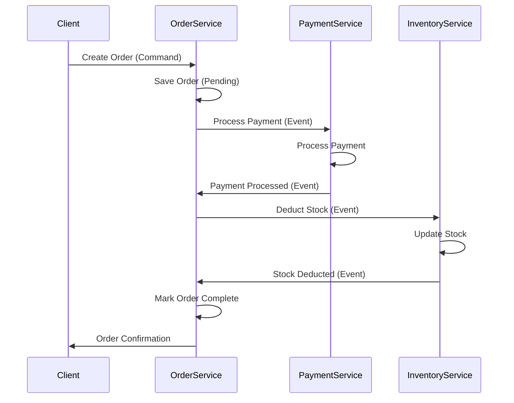
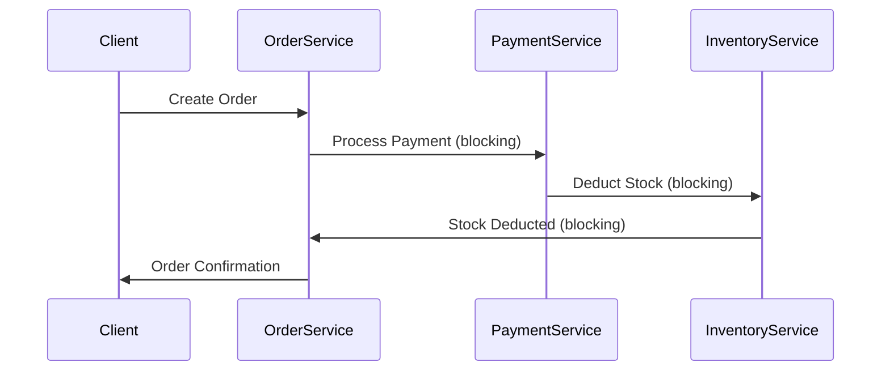

# Rule: Data Consistency Strategies

**Description:** This rule outlines various strategies for managing data consistency across multiple services in a microservices architecture. It covers patterns such as Eventual Consistency, Saga, and Command Query Responsibility Segregation (CQRS), providing guidance on how to handle distributed transactions and maintain data integrity in complex systems.

**Rationale:** Maintaining strong data consistency across multiple, independently deployed services is a significant challenge in microservices. Traditional distributed transactions often lead to tight coupling and reduced availability. Adopting appropriate consistency models and patterns helps manage this complexity, ensuring data integrity while preserving the benefits of a microservices architecture.

### Core Principles:
- **Eventual Consistency:** Adopt an Eventual Consistency model where immediate consistency is not strictly required, allowing services to operate independently and converge to a consistent state over time.
- **Saga Pattern:** Manage distributed transactions that span multiple services using the Saga pattern, which coordinates a sequence of local transactions, with compensating transactions to handle failures.
- **CQRS (Command Query Responsibility Segregation):** Separate read and write operations using the CQRS pattern to optimize performance and scalability for different data access patterns.
- **Event Sourcing:** Consider Event Sourcing as a way to reliably capture all changes to application state as a sequence of immutable events, which can be used for auditing, debugging, and rebuilding state.

### Good Practice:

*Example: A Saga pattern for an order creation process, ensuring eventual consistency across services.*

### Bad Practice:

*Example: Using a two-phase commit or blocking distributed transactions across microservices, leading to tight coupling, reduced availability, and potential deadlocks.*

---

**Automation Potential:** Event sourcing libraries and distributed transaction frameworks can assist in implementing these patterns. Code reviews are essential for validating the chosen consistency model and pattern implementation.

**Further Reading:** [Optional: Links to external resources, articles, or documentation related to this rule.]
