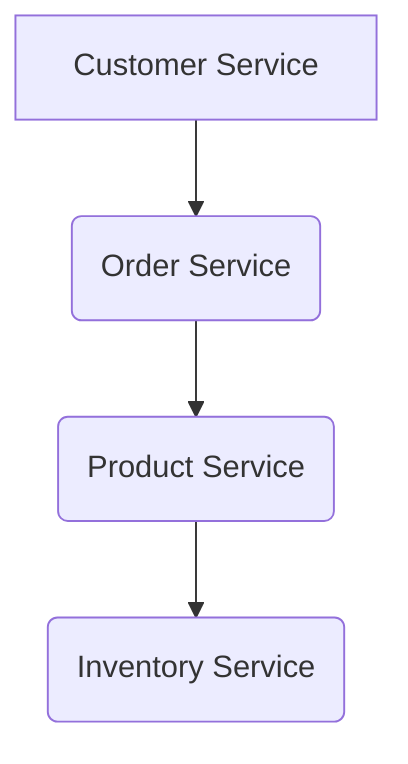
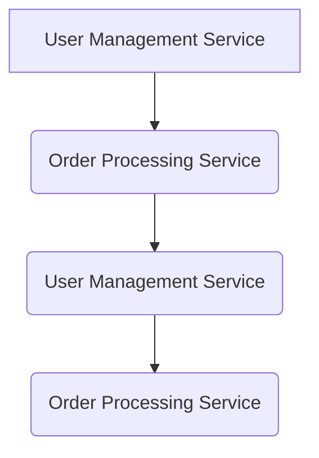

# Rule: Defining Microservice Boundaries

**Description:** This rule provides guidelines for establishing clear, independent, and well-defined service boundaries within a microservices architecture, primarily leveraging Domain-Driven Design (DDD) principles. The goal is to promote loose coupling, high cohesion, and independent evolution of services.

**Rationale:** Well-defined service boundaries are crucial for realizing the full benefits of microservices, such as improved scalability, resilience, and development agility. Poorly defined boundaries can lead to distributed monoliths, increased complexity, and reduced team autonomy. Adhering to this rule ensures that each service has a clear, single business responsibility.

### Core Principles:
- **Single Business Responsibility:** Ensure each service encapsulates a single, well-defined business capability or domain (adhering to the Single Responsibility Principle).
- **Bounded Contexts:** Define service boundaries using Domain-Driven Design (DDD) principles, establishing clear bounded contexts that encapsulate specific business domains.
- **Independent Deployability:** Design services to be developed, tested, and deployed independently of each other, minimizing inter-service dependencies.
- **Loose Coupling:** Strive for loose coupling between services, where changes in one service have minimal impact on others.

### Good Practice:

*Example: Services with clear, distinct business responsibilities and well-defined interactions.*

### Bad Practice:

*Example: Tightly coupled services with circular dependencies or overlapping responsibilities, leading to a distributed monolith.*

---

**Automation Potential:** Architectural analysis tools can help visualize service dependencies and identify potential boundary violations. Code reviews are essential for enforcing DDD principles and ensuring logical separation of concerns.

**Further Reading:** [Optional: Links to external resources, articles, or documentation related to this rule.]
