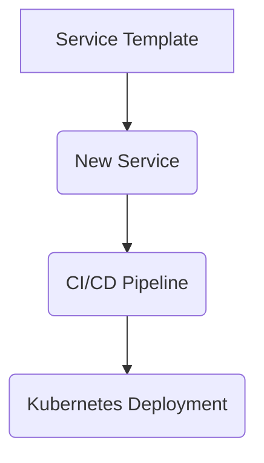
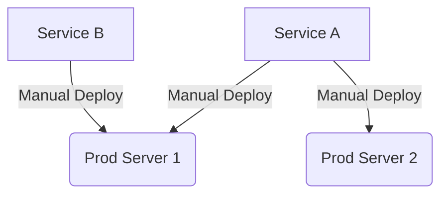

# Rule: Microservices Best Practices

**Description:** This rule outlines overarching best practices for streamlining the entire lifecycle of microservices, from development and deployment to ongoing operation. It focuses on ensuring consistency, automation, and efficient management of distributed systems to maximize the benefits of a microservices architecture.

**Rationale:** Adhering to a set of best practices for microservices development and operation is crucial for avoiding common pitfalls associated with distributed systems. These practices promote consistency across services, enable independent deployment, improve scalability, and enhance the overall maintainability and reliability of the system.

### Core Principles:
- **Standardized Service Templates:** Create and utilize a standard template or boilerplate for new microservices to ensure consistency in project structure, dependencies, and configurations.
- **Independent CI/CD Pipelines:** Set up dedicated Continuous Integration/Continuous Delivery (CI/CD) pipelines for each microservice, enabling independent and frequent deployments.
- **Orchestration Tools:** Leverage container orchestration tools (e.g., Kubernetes) for automated service discovery, load balancing, scaling, and management of microservice deployments.
- **API Versioning Strategy:** Define and implement a clear API versioning strategy to manage changes in service interfaces without breaking existing clients (referencing `restful-api-design.md`).
- **Regular Refactoring & Dependency Review:** Regularly review and refactor service dependencies and boundaries to prevent the formation of distributed monoliths and maintain loose coupling.

### Good Practice:

*Example: Using a service template and automated CI/CD for consistent and efficient microservice development and deployment.*

### Bad Practice:

*Example: Manual deployment processes and inconsistent service configurations, leading to errors, delays, and operational overhead in a microservices environment.*

---

**Automation Potential:** CI/CD platforms automate the build, test, and deployment of microservices. Container orchestration tools automate the management and scaling of services. Code reviews are essential for ensuring adherence to architectural and development best practices.

**Further Reading:** [Optional: Links to external resources, articles, or documentation related to this rule.]
