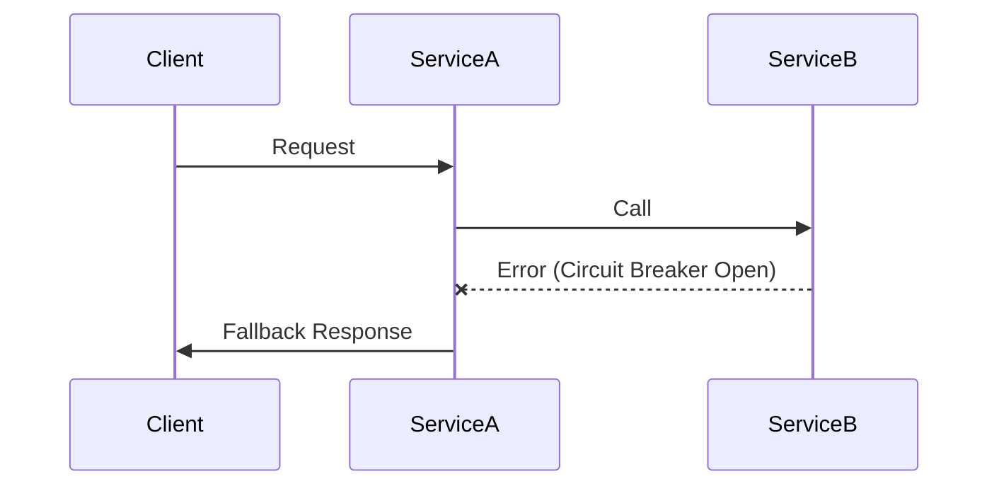
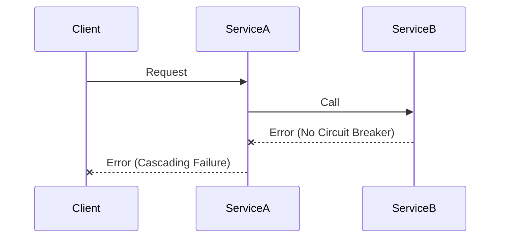

# Rule: Microservice Scalability and Resilience

**Description:** This rule outlines key principles for designing microservices that are independently scalable and highly resilient. It covers strategies for optimizing resource utilization, preventing cascading failures, and ensuring overall system stability through patterns like Circuit Breaker and robust health checks.

**Rationale:** Microservices architectures enable independent scaling of components, which is crucial for optimizing resource utilization and handling varying loads. Implementing resilience patterns like Circuit Breaker and having effective health checks are vital to prevent cascading failures, isolate issues, and improve the overall stability and availability of distributed systems.

### Core Principles:
- **Independent Scalability:** Design each microservice to be independently scalable, allowing individual components to scale up or down based on their specific demand without affecting others.
- **Circuit Breaker Pattern:** Implement the Circuit Breaker pattern to prevent cascading failures by isolating failing services and providing graceful degradation.
- **Health Check Endpoints:** Add dedicated health check endpoints to each service to allow monitoring systems and load balancers to determine service availability and readiness.
- **Bulkhead Pattern:** Use the Bulkhead pattern to isolate resources (e.g., thread pools, connection pools) for different services or components, preventing one failing component from exhausting resources for others.
- **Timeouts and Retries:** Implement appropriate timeouts for inter-service communication and strategic retry mechanisms with backoff to handle transient failures.

### Good Practice:

*Example: Service A using a Circuit Breaker to prevent calls to a failing Service B, providing a fallback response to the client.*

### Bad Practice:

*Example: A service directly calling another service without resilience patterns, leading to cascading failures when a dependency fails.*

---

**Automation Potential:** Container orchestration platforms (e.g., Kubernetes) automate scaling (horizontal pod autoscaling) and health checks. Libraries for implementing Circuit Breaker and other resilience patterns (e.g., Hystrix, Polly) can be integrated into code. CI/CD checks can ensure resilience patterns are implemented.

**Further Reading:** [Optional: Links to external resources, articles, or documentation related to this rule.]
