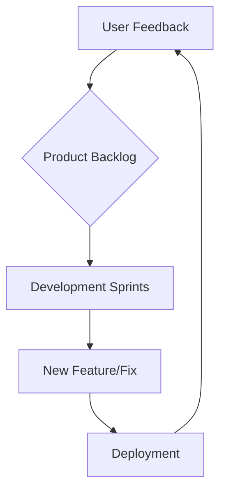
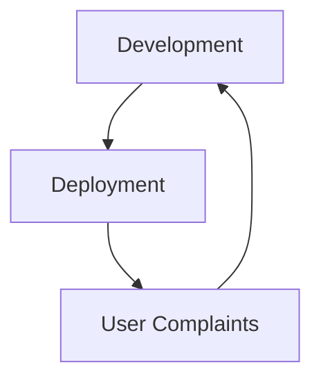

# Rule: Development Process Improvements

**Description:** This rule provides guidelines for fostering a culture of continuous improvement within development processes. It covers essential practices such as systematically collecting and incorporating user feedback, proactively managing technical debt, and continuously optimizing Continuous Integration and Continuous Delivery (CI/CD) pipelines.

**Rationale:** Continuous improvement of development processes is crucial for achieving faster delivery cycles, higher software quality, and increased team efficiency and morale. Establishing effective feedback loops ensures that product development remains aligned with user needs, while proactive technical debt management prevents long-term stagnation and reduces future development costs. Optimized CI/CD processes enable rapid and reliable deployments.

### Core Principles:
- **User Feedback Integration:** Systematically collect user feedback and integrate it into the product development process to drive iterative improvements and ensure user satisfaction.
- **Technology & Best Practice Research:** Regularly research and evaluate new technologies and best practices, integrating suitable ones to keep the development stack modern and efficient.
- **CI/CD Optimization:** Continuously optimize Continuous Integration and Continuous Delivery (CI/CD) processes to ensure fast, reliable, and automated software delivery.
- **Technical Debt Management:** Proactively identify, prioritize, and address technical debt through regular refactoring and dedicated efforts to maintain code health (referencing `refactoring.md`).

### Good Practice:

*Example: A continuous feedback loop integrating user input into the development process.*

### Bad Practice:

*Example: A reactive development process where user feedback is only addressed after complaints, leading to slower response times and potential user dissatisfaction.*

---

**Automation Potential:** CI/CD platforms automate build, test, and deployment processes. Project management tools (e.g., Jira) and feedback collection systems (e.g., Intercom, UserVoice) facilitate feedback management. Code quality tools can help identify technical debt.

**Further Reading:** [Optional: Links to external resources, articles, or documentation related to this rule.]
