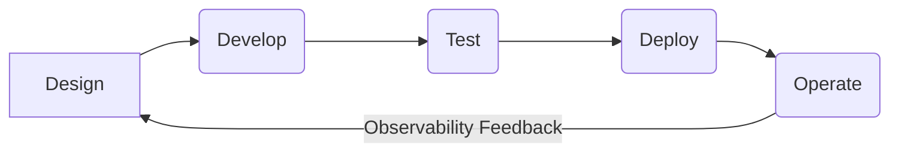

# Rule: Observability Best Practices

**Description:** This rule outlines overarching practices to ensure that observability is treated as a first-class citizen throughout the entire software development lifecycle. It emphasizes integrating observability from the initial design phase to deployment and operations, leading to more resilient systems and effective incident management.

**Rationale:** Treating observability as a core requirement, rather than an afterthought, is crucial for building and maintaining reliable, high-performing systems. A comprehensive observability strategy enables teams to understand system behavior, quickly diagnose issues, and make informed decisions, ultimately leading to faster incident resolution, improved user experience, and reduced operational costs.

### Core Principles:
- **Implement Observability from the Start:** Integrate logging, metrics, and tracing into the application design and development process from the very beginning, not as an afterthought.
- **Consistent Naming Conventions:** Use consistent naming conventions across all metrics, logs, and traces to ensure clarity and facilitate correlation.
- **Document Observability Strategy:** Clearly document the observability strategy, including what is being monitored, why, and how to interpret the data.
- **Regular Review and Update:** Regularly review and update dashboards, alerts, and observability tools to ensure they remain relevant and effective as the system evolves.
- **Practice Incident Response:** Implement and regularly practice incident response procedures, leveraging observability data to quickly identify, diagnose, and resolve issues (referencing `alerting-strategy.md`).

### Good Practice:

*Example: Integrating observability as a continuous feedback loop throughout the development lifecycle.*

### Bad Practice:

*Example: Adding observability only after encountering problems in production, leading to reactive troubleshooting and increased downtime.*

---

**Automation Potential:** Observability platforms (e.g., Prometheus, Grafana, ELK Stack, OpenTelemetry) integrate logging, metrics, and tracing components, automating data collection and visualization. CI/CD checks can ensure that new code includes appropriate instrumentation. Code reviews are essential for validating the observability strategy and implementation.

**Further Reading:** [Optional: Links to external resources, articles, or documentation related to this rule.]
